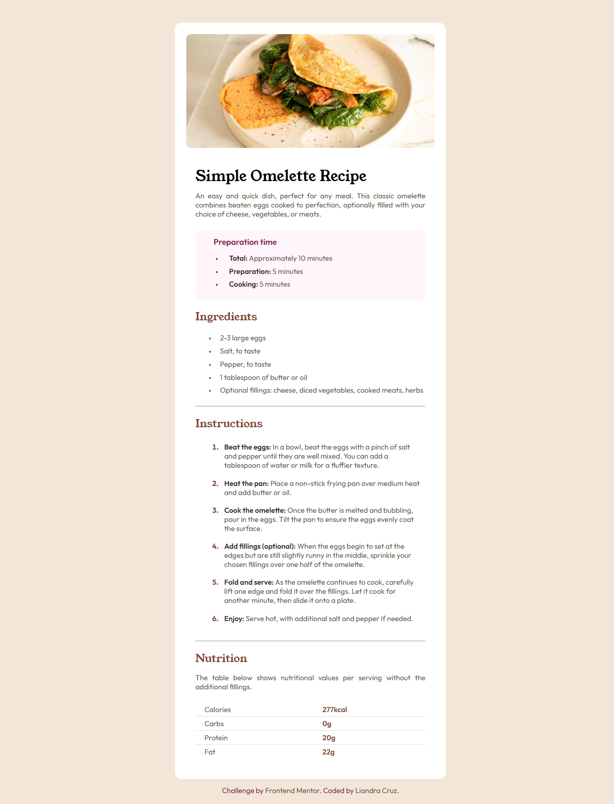

# Frontend Mentor - Recipe page solution

This is my solution to the [Recipe page challenge on Frontend Mentor](https://www.frontendmentor.io/challenges/recipe-page-KiTsR8QQKm).

## Table of contents

- [Overview](#overview)
  - [The challenge](#the-challenge)
  - [Screenshot](#screenshot)
  - [Links](#links)
- [My process](#my-process)
  - [Built with](#built-with)
  - [What I learned](#what-i-learned)
  - [Continued development](#continued-development)
  - [Useful resources](#useful-resources)
- [Author](#author)

**Note: Delete this note and update the table of contents based on what sections you keep.**

## Overview

### Screenshot



### Links

- Solution URL: [Add solution URL here](https://github.com/liandracruz/frontend-mentor-challenges/tree/main/my-challenges/recipe-page)
- Live Site URL: [Add live site URL here](https://liandracruz.github.io/frontend-mentor-challenges/my-challenges/recipe-page/index.html)

## My process

My first step was to analyze the challenge's design to decide how the HTML should be structured. After defining the content layout, I created a CSS style sheet to start working on the visual design
In the CSS file, I started adding the fonts and setting up a :root to have a more efficient access to the colors and typography of the project. Next, I first defined the global styles and continued based on the HTML structure. 
I also followed the mobile first approach for better responsiveness and later added media query to adapt the project layout for larger screens.

### Built with

- Semantic HTML5 markup
- CSS custom properties
- Media query

### What I learned

Through this challenge I believe my main lesson occurred while working on CSS. I started defining the properties 


To see how you can add code snippets, see below:

```html
<h1>Some HTML code I'm proud of</h1>
```
```css
.proud-of-this-css {
  color: papayawhip;
}
```
```js
const proudOfThisFunc = () => {
  console.log('🎉')
}
```

If you want more help with writing markdown, we'd recommend checking out [The Markdown Guide](https://www.markdownguide.org/) to learn more.

**Note: Delete this note and the content within this section and replace with your own learnings.**

### Continued development

Use this section to outline areas that you want to continue focusing on in future projects. These could be concepts you're still not completely comfortable with or techniques you found useful that you want to refine and perfect.

**Note: Delete this note and the content within this section and replace with your own plans for continued development.**

### Useful resources

- [W3 Schools](https://www.w3schools.com/) - W3 Schools helped me find solutions for some questions that I had through the process, especially about CSS.
- [MDN Web Docs](https://developer.mozilla.org/en-US/) - The MDN website was an important source that helped me to built a better HTML structure and also find solutions for some issues that I had during the challenge. 

## Author

- GitHub - [Liandra Cruz](https://github.com/liandracruz)
- Frontend Mentor - [@liandracruz](https://www.frontendmentor.io/profile/liandracruz)
- Linkedin - [Liandra Cruz](www.linkedin.com/in/liandra-cruz-971a32350)